# Large Rhythm Collider

## Overview
You've found the Large Rhythm Collider! This website houses a multifaceted apparatus designed for the analysis of Polyrhythms. 

  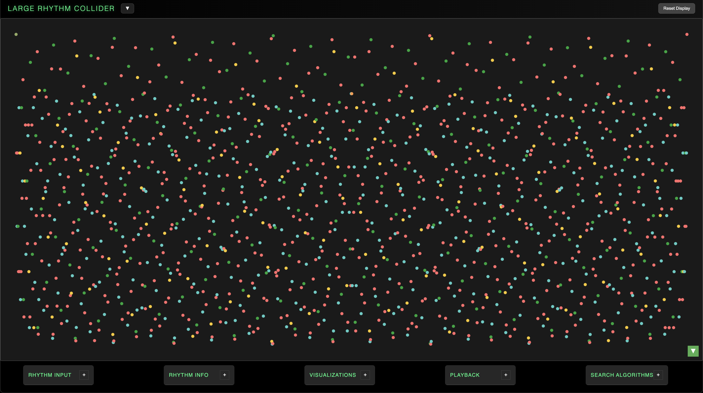

The Large Rhythm Collider offers a suite of analytical and creative tools which parse the fine details of polyrhythmic structures and deploy this information as the source code for a range of audiovisual applications. This intersection of art and mathematics possesses intricate generative beauty.

If you've never encountered polyrhythms before, there are lots of great resources online which explain the basics. The LRC transforms the simple properties of cyclic division into an esoteric trove of patterned syncopation and structure. I always wondered what sort of things would be unveiled by pushing against the boundaries of this mathematical space. Ideas born years ago as thought experiments and practice routines have led me down the rabbithole to the architecture of this program. I hope you'll enjoy this journey as much as I have! 

On the main page, you'll find 5 draggable, expandable control modules: Rhythm Input, Rhythm Info, Visualizations, Playback, and Search Algorithms. These sections provide full control of the LRC's functionality.

  

The LRC is designed to analyze polyrhythms of up to 4 layers. These ratio layer combinations a:b:c:d are bound by a simple multiplicative logic which encodes the internal strucutre of each rhythm. The core algorithm, while detailed, is simple arithmetic. The limitation to 4 layers is both a drummer's analogy and a computational consideration to keep the internal architecture manageable. 

## Quick Start
### Technical Requirements
As a fully JavaScript / HTML / CSS based web app, basic functionality should run smoothly on most systems. However, the system is designed to investigate Large Rhythms, so just remember that big numbers = more processing power.

#### Browser Compatibility
- **Required**: Modern browser with Web Audio API support
  - Chrome 66+ (recommended for best performance)
  - Firefox 60+
  - Safari 14.1+
  - Edge 79+
- **Required**: JavaScript ES6+ support
- **Recommended**: Hardware acceleration enabled for smooth visualizations

#### System Requirements
- **RAM**: Minimum 4GB recommended for complex polyrhythm calculations
- **CPU**: Multi-core processor recommended for real-time audio processing
- **Audio**: Dedicated audio hardware preferred for low-latency playback
- **Display**: Minimum 1024x768 for full interface visibility

#### Audio System Requirements
- **Sample Rate**: 44.1kHz or 48kHz (automatically detected)
- **Buffer Size**: Adjustable via Web Audio API (128-1024 samples)
- **Latency**: <50ms for real-time parameter adjustment
- **Channels**: Stereo output supported

### Installation & Launch
The LRC is available at https://www.largerhythmcollider.com.

1. Download or clone the repository
2. **Simply double-click `index.html`** to open in your default browser
   - Or right-click → "Open with" → choose your preferred browser
3. Allow audio permissions when prompted
4. Start exploring polyrhythms!

### First Run Checklist
- [ ] Audio context activated (click anywhere if needed)
- [ ] Web Audio API detected (check browser console for errors)
- [ ] Test basic rhythm input (try 3:2, 7:5:3:2 polyrhythm)
- [ ] Verify playback functionality
- [ ] Check export functionality (MIDI download)

## Mathematical Foundation
The Large Rhythm Collider employs a simple, naturally emergent algorithm to describe the composite structure of any given polyrhythm, but the real novelty is in the subsequent serialization of this polyrhythmic DNA into musical tuning systems. The following explanation is detailed, but some background research regarding: rhythmic subdivision and meter, polyrhythms, the harmonic series, tuning and temperaments, just intonation and the general physics of sound will help everything "click".

### Core Concepts
Up to 4 frequency layers are defined a:b:c:d. To be a valid polyrhythm, the layers must be coprime as a set (share no common factors), and no layers may be direct factors of another. However, individual layer pairs or tuples may share common factors. For example. 8:7:6:5 is valid because while 8:6 share a common factor, the entire layer set is comprime thanks to the 7 and 5. 8:7:6:4, on the other hand, would be invalid: the 4 adds no new information to the rhythm as it is already described by the 8. Note also that a layer value of 1 merely represents the entire cycle undivided.

The LRC still allows for layer values that do not meet these criteria, but Search Algorithms will only return valid results. 

The least common multiple of the layer frequency values is the Grid, which is the length of the total cycle for this polyrhythm. When we divide the Grid by each of the layers, we get the grid duration or grouping size of each of those layers' pulses. 

  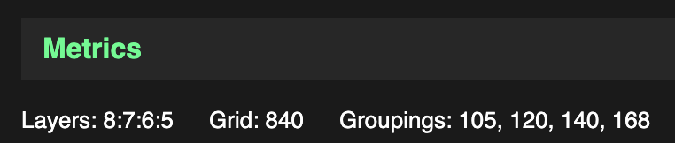

Note that "polyrhythm" and "polymeter" are here shown to be two sides of the same coin. Polyrhythms (frequency layers) are described by stacks of differently-sized meters (grouping sizes). This fundamentally "relativistic" relationship of two interdependent dimensions is what truly defines the deterministic, yet mysterious behavior of polyrhythmic systems.

When we construct a flattened list of all multiples of grouping sizes (pulse durations) up to the Grid value, we get the attack positions of every note in the Composite Rhythm. 

  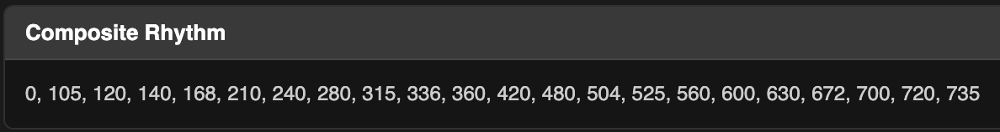

By analyzing the pulse layers as one whole, we extract their synergy. If we take the difference between every position in the Composite Rhythm, we get the Spaces Plot - the unique series of durations encoded specifically by interference pattern of the layer inputs. We also track which layers generate which values in the spaces plot. This sequence is always a palindrome, as a consequence of its cyclic, multiplicative construction.

  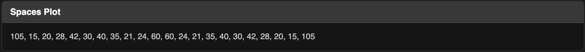

From here, we move to the core innovation of the Collider concept: serialization of the spaces plot into pitch information!

### Scale Creation
Just as the generating layer values represent ratios of frequencies, the unique slices of time generated by their interference patterns can also be assessed by their relative size/speed relationships. If we think of each of these values as the length of a period of a sound wave relative to all others in the set, we extract a tuning system! This is the conceptual leap, but is grounded in the ratio logic of polyrhythmic / harmonic series behavior. Essentially, the polyrhythm's structure encodes various little segments of time, all measured in relation to one another on the underlying grid; if we use all of those little segments to define the literal sizes of sound waves periods, that group of sound waves will possess a "scale" of relative frequency relationships, described by ratios (just like the generating layers). 

Here's the simplest example - 3:2. This rhythm has a grid of 6, and is comprised of 3 groups of 2 and 2 groups of 3. We have a composite rhythm 0,2,3,4 (6) which gives the spaces plot 2, 1, 1, 2 (notice that we calculate the distance from 4 to 6, the beginning of the next cycle). Two unique values, 2 and 1. What ratio relationship does this give us?

We have a sound wave with length 2, and a sound wave with length 1. It's easy to see that we'll have two ones for every two - the shorter soundwave has a frequency of 2/1 relative to the largest sound wave in the set. 2/1 is exactly equivalent to an octave. So our tuning system really just has one note, which is repeated an octave higher. Try inputting 3:2 and playing it back to hear what this sounds like when we apply the proper pitches to corresponding note sizes in the spaces plot. 

  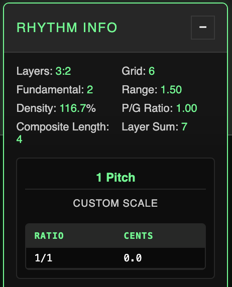

Notice that when we convert from size to pitch, an inverse thing happens - 1/1 is 2 units long, 2/1 is 1 unit long. How does this work when with a more complex rhythm?

Let's try the first four primes - 7:5:3:2.

The LCM or Grid for these numbers is 210, with grouping sizes 30, 42, 70 and 105 respectively. Arranging the composite rhythm and finding the difference between each position gives us this spaces plot:

30, 12, 18, 10, 14, 6, 15, 15, 6, 14, 10, 18, 12, 30 - Notice we still have a palindrome. The unique values are: 30, 18, 15, 14, 12, 10 and 6. 

Note that the largest value in the spaces plot set is always the first, and last. It's the grouping size of the fastest layer: because this layer is the fastest, it is always the first to occur after the downbeat, and because it continues repeating with the same duration, no value in the plot can possibly be larger. As largest value, it defines the longest or slowest oscillation of a sound wave - meaning the lowest pitch. This value is our Fundamental: it becomes the numerator against which all other ratios are compared as an undertone. The Fundamental is always the quotient Grid / Layer A.

The smaller the value is, the faster the wave and the higher the pitch. This is why the Fundamental or largest value becomes an undertone generator. Take 30 and 18. First we can cancel out the shared factor of 6, leaving 5 and 3. Now, we know there will be five threes for every 3 fives. That means the 3 (or 18), which is the higher of the two pitches, is tuned to 30/18 or 5/3 above the Fundamental. All other unique values will initiate the same undertone comparison, generating the full pitch set.

The final principle we apply to scale creation is octave compression - displaying all values within one octave. For tone row playback, we preserve the proper octave for each value, but for legible display of the tuning system, we compress all values in between 1/1 and 2/1. Take the above 7:5:3:2 scale - with 30/12, for example, we would simply move this frequency down an octave by halving it, multiplying the denominator by two and thus giving us 30/24 which simplifies to 3/2. This also means that, while every unique value in the spaces plot defines a unique octaviated interval, direct doubles (like 12 and 6 in this example) will create the same pitch in the final scale after octave compression.

Try 7:5:3:2 on the main page and you'll see a 5-tone scale, 1/1, 15/14, 5/4, 3/2, and 5/3. Note that the octave 2/1 may or may not always be present in any spaces plot, but we never include it in the final scale.

  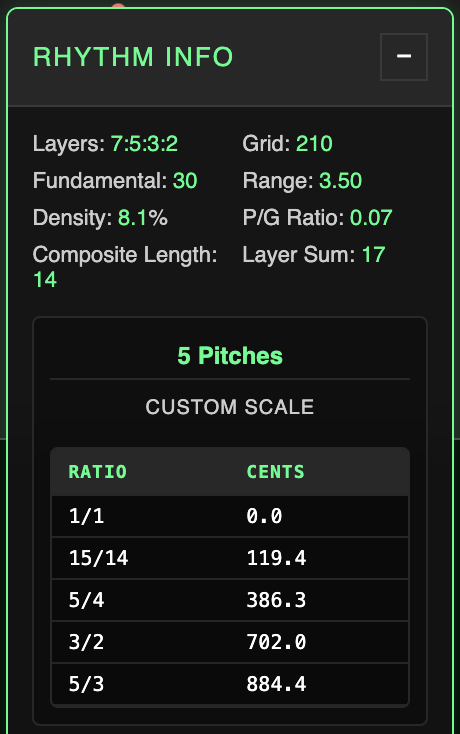

### Tuning Systems 
You'll notice that our scales are comprised of ratios, with corresponding Cents values. In microtonal music theory, ratio-based or harmonic-series based tuning approaches fall under the umbrella of Just Intonation. "Microtonal" tuning refers to any system which formally includes pitches not available in standard 12 tone equal temperament (12TET), which divides the octave intwo twelve equal partitions. Cents measure pitch space as it relates to 12TET - 1200 cents equals one octave, 100 cents equals one semitone. In contrast to goal-oriented tunings like 12TET or sophisticated Just Intonation systems, the Large Rhythm Collider's methodology is somewhat mechanical and brutal; nonetheless, the deterministic bounds of the essential rhythm math bear curious strengths thanks to the breadth of available inputs and their emergent generative behaviors. 

### Conclusion
The Spaces Plot conversion via relative waveform period is the core math of the Large Rhythm Collider serial concept. The opaque prime factor relationships between layer values combined with the multi-step scale creation algorithm creates results with a degree of entropy that naturally implores the emergence of deeper analytical methods. I came to realize that the LRC tuning concept provides a detailed scaffolding to classify polyrhythms by their relative complexity, by assessing the granularity of the information they possess.  

The kaleidoscopic inner worlds of polyrhythms are made mappable and musical through the core analysis / sonification algorithm. Frequency layers become pulse "arpeggiators" of their rhythms' bespoke tuning systems, washing over one another in blurred counterpoint. The scale creation concept also opens doors for organization, classification and implementation outside of the purely musical realm, as you'll see in some of the visualizations. The engine's larger purpose is to compile polyrhythmic data into a unique, natural procedural generation system with widespread potential for application.

  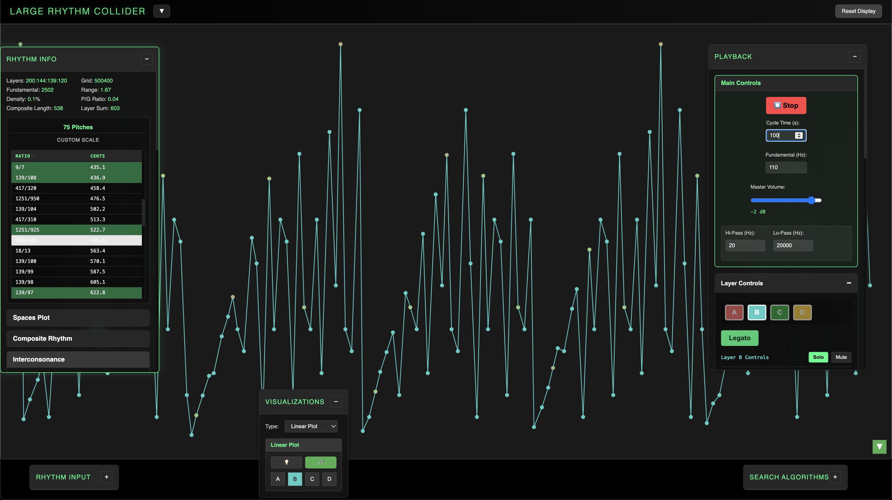

## Key Features

### Usage
Numbers go in, patterns and music come out. Use up to 4 whole numbers in the Rhythm Input section to define a polyrhythm. Pressing Generate will prepare the system with that rhythm. You can access metrics in Rhythm Info, Search for specific rhythm results, try different Visualizations, and Playback audio synced to the rhythm's internal timing and tuning systems. The following section includes detailed description of all features.

### Core Functionality
- **Polyrhythm input and processing (up to 4 layers)** - In the main Rhythm Input section, the user can enter up to 4 layers of frequency and use Generate to process them through the core analytical engine.
- **Composite rhythm generation** - Automatic calculation of all attack positions across all layers
- **Spaces plot calculation** - Derivation of the palindromic duration sequence
- **Automatic scale/tuning system derivation** - Just intonation tuning systems generated from rhythm structure
- **"Interconsonance" analysis** - Reveals familiar-sounding intervals within the generated scales
- **Real-time audio playback** - Wavetable synthesis with full ADSR and filter control
- **5 visualization modes** - Linear Plot, Reflections, Centrifuge, Hinges, and Collider Battle
- **4 rhythm-finding search algorithms** - Layer, Grid, Fundamental, and Inverse PG searches

### Rhythm Info / Expanded Info View

  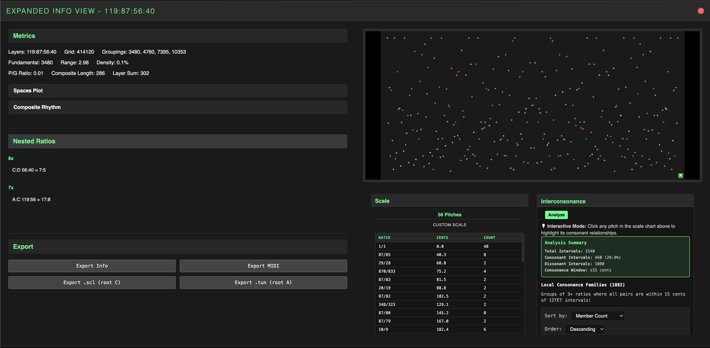

The Rhythm Info div displays the relevant metrics and ratio scale for any generated rhythm, as well as the Interconsonance Analyzer and export functionality. Double-clicking the div opens an Expanded Info View with more detail.

#### Metrics

  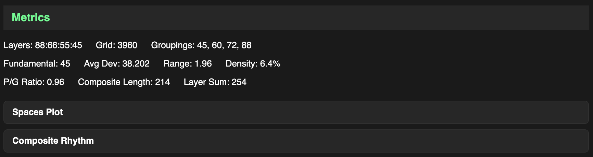

Rhythm Info displays the Layers, Grid and Fundamental values for this rhythm-scale (recall that the Fundamental is the grouping size of Layer A), along with a few other metrics:
- Range: quotient of the fastest over slowest layer
- Density: percentage, quotient of layer sum over grid
- P/G Ratio: percentage, quotient of layer sum over grouping sum
- Composite Length: unique positions in composite rhythm
- Layer Sum: sum of all layer frequency values, distinct from Composite Length due to nested ratios / coincidence on downbeat

Range describes the literal frequency range of the polyrhythm layers - rhythms with smaller range values are more tightly packed. 

Density percentage tells us "how much of the grid is covered by the rhythm?". I use Layer Sum instead of Composite Length to give credence to the full "weight" of all frequency layers. High-frequency nested ratios can cause higher density by adding frequency values while constraining growth of the overall LCM.

P/G ratio is a subtler metric that weighs the overall sum of the frequency values against the sum of the grouping sizes which create them. The grouping sum will always be greater than the layer sum, and higher density rhythms tend to have a higher P/G ratio, but P/G generally declines as Grid values grow. Rhythms may also have a P/G value of 1 - see Inverse PG section in Search Algorithms. 

One special metric, Average Deviation only applies to 12-tone rhythm scales. This metric relates our microtonal just-intonation scales to the dominant contemporary tuning system, 12 tone equal temperament (12TET) in which the octave is logarithmically partitioned into 12 equal semitones, which we measure as 100 cent intervals of pitch space. Average Deviation is calculated by determining the intervallic cents distance between each successive step in the scale, and calculating the deviation from 100 cents. For example, a 79 cent interval has a deviation of 21 cents, while a 105.6 cent interval has a deviation of 5.6 cents. We take the average of all 12 deviation values to yield the final metric. What do you think the minimum average deviation for a 12-tone scale might be? 

If you still need more numbers you can expand the Spaces Plot or Composite Rhythm sections to view the actual sequential source code of the given rhythm. 

Expanded Info View shows the same metrics as Rhythm Info, but it also includes the Grouping sizes for all layers, and a section called Nested Ratios.

##### Nested Ratios

  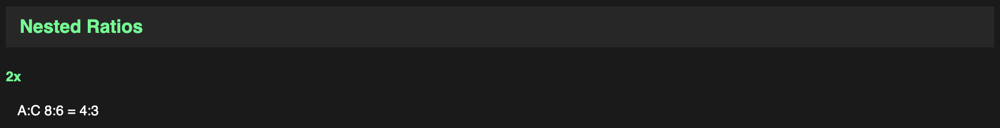

Valid polyrhythms must be coprime as a set, and have no layers which are direct factors of another layer. When only 2 layers are present, they may not share any factors. However, for 3 and 4 layer rhythms, common factors amongst layer tuples are allowed and provide abundance of specific classes of results by constraining scale size growth despite grid growth thanks to nested resolution patterns within the larger cycle - nested ratios. Even a simple rhythm, like the page default 8:7:6:5, has a nested ratio of 4:3 occurring twice between layers 8:6 (A and C). That's why the Nested Ratios section for this rhythm shows 2x A:C 8:6 = 4:3. 

#### Interconsonance

  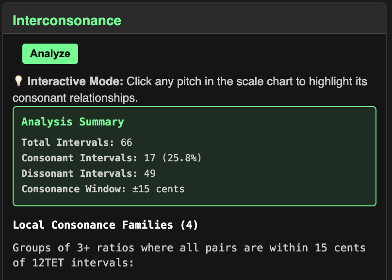
  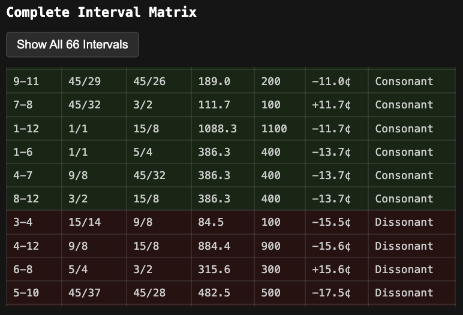

The final analytical component of the Info Divs is the Interconsonance Analyzer. Just like the Average Deviation concept, the ICA is a bridge to the "familiar" sounds of 12TET. 

While the average deviation metric calculates the intervallic distance for all sequential steps, the ICA calculates the full interval matrix of all available interval pairs in the set. The number of available unique pairs can grow very large, so this feature may break down for very large scales, but it can still comfortably handle scales with 100 pitches per octave. These intervals are then assessed for "consonance", which in our system will refer to intervals which are within a +-15 cent window of a multiple of 100 cents. These intervals are relatively close to the familiar 12TET intervals most of us are used to. The analyzer then finds subsets of ratios within the rhythm which all share consonance and organizes them into Consonance Families. 

#### Export
The export section allows the user to export a PDF with the Expanded Info View details for the generated rhythm. The user can also export MIDI and tuning file information, described in the Audio section. 

### Audio & Export
The LRC has a detailed playback system for its tone rows, as well as all necessary export functionality to generate the tuning systems and individual layer MIDI for use in a DAW.

#### Master Tempo / Fundamental Controls
- Set the interval in seconds for one full cycle
- Set the tuning of the fundamental frequency (defaults to A 110hz)
- Master Volume with limiter

The seconds value defines the length of the entire cycle- play ultra fast rhythms or stretch them out to long legato scales. Cycle Time will accept values between 0.1 and 6000 seconds.

The Fundamental input accepts Hz values between 55 and 880hz. Harsh high frequencies are automatically culled from playback, which is why you may hear occasional gaps correspondent to very small spaces plot values.

The Master Volume slider defaults to a safe -24dB and has a final limiter, but still be cautious when playing raw sine waves at high volumes.

#### Layer Controls
- Select from sine, triangle, sawtooth or square wave for each layer
- All layers have individual volume control, soloing / muting
- All layers have individual lo / hi pass filter
- All layers have individual ADSR envelope
- Legato mode ensures notes are held out for their full value

The LRC offers extensive DAW-like control over individual layer audio. Layers can be soloed, muted or have their volumes set individually. Basic waveform synthesis offers sine, triangle, square and sawtooth waves, along with an individual ADSR envelope and simple filter for each layer.

The ADSR knobs can be double-clicked to manually edit their values.

Legato mode is a global control which toggles retrigger behavior: when legato mode is off, each new note in the spaces plot silences the previous note. In Legato mode, notes on each layer are held out until that layer sounds again. This allows one to hear the harmonic tuning relationships within each system sustained at slower tempos.

#### Scale Selection
- Turn individual pitches on and off using the scale chart in the Playback div
- Corresponding lights will toggle on/off in the Linear Plot
- Select Interconsonance Families directly from the Playback div

With Scale Selection you can select and deselect pitches in real time to create smaller subsets of the larger tuning system. Alongside the scale chart, you'll see the Count for each ratio, which is the number of times it actually appears in the spaces plot.

Toggling pitches in Scale Selection will also toggle them on and off in Linear Plot, helping you visualize what you add and subtract as you hear it.

If Interconsonance has been run in the Rhythm Info div, individual interconsonance families can also be automatically selected in Scale Selection.

#### MIDI Export by Layer
- Export MIDI with proper tone row sequencing for each layer. These large MIDI clips can be resized / repurposed in your DAW
- To use the true tuning information, you'll also need a tuning file

Because of the intense level of subdivision inherent in the growth of Grid values, exporting and using accurate MIDI is challenging. When you export MIDI from the web app, you'll get large clips for each individual layer with each note in sequence according to that layer's portion of the tone row. If you wish to then hear the layers with their true polyrhythmic relationships, you'll need to resize the clips to the same interval of time (say 1-8 bars). Otherwise, the MIDI is yours to experiment with as are the tuning systems:

#### .tun / .scl Tuning File Export
- Microtonal tuning file export for .tun and .scl formats

Playback of microtonal tuning systems in-the-box requires a software synth that can read tuning files. The LRC has export options for two common tuning file formats, .tun and .scl. Scales exported with .tun will have their root note at midi note 9, A-1, while scales exported with .scl are rooted around C.

If you need other formats, I highly recommend [Sevish's scale workshop](https://sevish.com/scaleworkshop).

### Visualizations
The LRC offers 5 visualization types.

#### Linear Plot
- Primary visualization graphs palindromic sequence of spaces plot values
- Layers are denoted by toggleable colored lights
- Lights illuminate in sync with playback
- Connectors show individual layer sequence

The linear plot is the original visualization concept that led me to explore various applications for the polyrhythmic source data. Playing with the initial layer inputs can create a wide range of patterns, all of which bear a Rorschach-esque horizontal symmetry due to their palindromic construction.

All layer lights may be toggled off with the lightbulb switch. You can view individual layer sequences by selecting any of the ABCD layer toggles. You can also press the Chain button to connect the notes for each layer in sequence.

The Linear Plot and its layer lights sync to playback. It also responds to Scale Selection from the Playback div, hiding notes which have been turned off. This allows the user to hew more minimal audiovisual designs from the larger rhythm structure.

You can use the green arrow toggle in the bottom right hand corner of the plot to flip the vertical axis. This allows for more intuitive visual sync with audible pitch information during playback; since   smaller values correspond to higher pitches, the default view places these values lower on the y-axis, which is a bit counterintuitive.

#### Reflections (popup)
- Duplication and manipulation of inherent palindromic structure creates detailed symmetric patterns
- Various controls allow for different levels of reflection / tessellation
- Basic animation options
- Export functionality for still images or animations

Reflections grew out of the simple observation that the inherent horizontal symmetry of the Linear Plots would create distinct mandala-like patterns if they were simply duplicated and reflected over one another with increasingly axes of symmetry. The Reflections popup has 5 main sections: Reflections, Tessellation, Animation, Colors, and Export.

##### Reflections Controls
- **Type Selector** offers Overlay and Reflecting Pool. Overlay draws each subsequent reflection directly over the layers below it. Reflecting Pool draws the first reflection (level 2) above a horizon line drawn at the top of the original graph, creating a mirror or reflecting pool visual. Subsequent levels are overlaid a la type 1.
- **Blend mode** offers two useful blend modes: Difference, which creates interesting color shifts during animation, or Screen, a simpler and less computationally expensive overlay.
- **Reflection level** allows for up to 4 plot duplications, each reflected over new lines of symmetry (180, 90, 45 degrees).
- **Dot size** resizes dots.

##### Tessellation
Tessellation allows the user to create up to a 4x4 tessellated grid of the Reflections image.

##### Animation
- Master time control sets animation speed
- Rotate the image around the center to see the symmetric structure shifting and phasing
- Translate the image in 4 directions, with or without simultaneous rotation
- Background plot toggleable to view rotation / translation with no blending

##### Colors
- Set colors for main plot, background plot, and canvas background
- Color picker includes HSB sliders, Hex codes or RGB values.

##### Export Visualization
- Export square png image of Reflections plot to your chosen dimensions
- Video export available (though web encoding capacities are somewhat limited)
- Set dimension, frame rate and cycle time for animation
- Enable rotation, translation, or both
- Smart algorithm assesses level of duplication to reduce frame render counts
- Progress bar tracks render / encoding phases

I haven't yet been able to get the web-encoding framework to be able to properly accommodate complex plots with high dot counts and expensive Difference blending without a significant quality drop. There's definitely room for improvement. 

#### Centrifuge
- Layers visualized by spinning wheels
- Scale ratios displayed around perimeter
- Laps sync with tone row playback
- Perimeter ratios also light up in sync
- Inner segments illuminate as layers rotate

The Centrifuge visualization is a simpler visualization which displays each layer as a spinning wheel. The radii of each layer corresponds to the layer's grouping size, and their rotation speeds correspond to their frequencies. Individual segments illuminate in sync with playback as their notes ring out. The perimeter of the centrifuge also displays the ratios in the current scale, and illuminates them in sync with playback as well. 

#### Hinges
- Physical simulation generating structure and vector information from spaces plot
- Spaces plot as links in a linked chain
- Controls for cycle speed and amplitude of layer vector forces
- Toggleable layer forces display
- User changes individual layer vector directions with arrow keys
- 3 modes with different animation approaches
- Anchors mode allows for Expansion behavior and deep control based on nested ratios

The Hinges visualization uses the internal rhythmic structure to generate a physical simulation, almost screensaver-like. Each value in the Spaces Plot defines a length of a segment in a chain, which is linked end to end upon starting the animation, binding the chain with an internal constraint system.

The source layer for each node and the corresponding value in the spaces plot defines a direction and magnitude for a motion vector for each node. The user can set the direction for each layer individually by clicking of each arrow and pressing an arrow key for a new direction. There are three Hinges modes utilizing this layer force progression:

##### Layer Progression
In Layer Progression mode, the layer forces are triggered one by one according to the overall Cycle time and Amplitude multiplier. Try setting the Cycle time very short with high Amplitude to see the structure swim around wildly! You can also see the actual vector force matrix with the Layer Forces toggle.

##### Mirrors
Mirrors executes the layer forces in a mirrored pattern, moving in opposite directions from the central node. This aligns with the palindromic nature of the Hinges construction.

##### Anchors
Anchors offers more structural control. Anchors allows you to lock certain nodes in the structure, either based on their generating layer or based on Nested Ratios calculated between the polyrhythm layers. Anchors also offers Expand functionality which inflates the Hinge structure to its maximum extent. This can do some pretty wild things when paired with locking behaviors.

While using any of the three modes, you may also engage Tension, which freezes layer progression and prompts each segment in the structure to seek a flat angle with its neighbors. This slows everything down and creates an odd, twisting screensaver-like pattern.

#### Collider Battle (popup)
- Multiple Hinge rhythm structures battle it out!
- User generates up to 4 starting polyrhythms
- Each rhythm is animated according to Hinges vector animation principles
- Rhythms dance and collide, node-to-segment collisions cause the defending player to lose that segment
- Actual scale ratios sound out as segments are destroyed
- Battle progresses until only one player remains
- User can control cycle speed, force amplitude, line thickness (for visibility) and audio volume

After developing Hinges, I of course had the thought "what if these could fight?" Quickly I realized I could use the Collider name in truth, and let multiple Hinge structures dance around the scene, their nodes and segments colliding. Players can create their own rhythm with a Linear Plot preview on the Player Creation screen. In battle, if an attacking node strikes a player's segment, that segment is destroyed and its corresponding value is removed from the Spaces Plot and the layer force progression for that rhythm. The segments also sound out according to their actual note in their rhythm's tone row! A player is eliminated when all of their segments have been destroyed - last player standing wins. Gravity eventually kicks in and pulls players towards the center. Master controls influence cycle speed, force amplitude, line thickness (for visibility of large rhythms) and audio volume.

Due to the computational expense of force progression, collision detection and structural reconnection for multiple large rhythms, the Collider battle has a much lower ceiling on complexity than say, Linear Plot, but you can still generate some pretty dynamic battles. 

### Search & Analysis
A large part of the impetus to develop an engine for the Large Rhythm Collider concept was to enable the discovery and classification of rhythms at a much faster rate than working by hand. The engine offers 4 types of Search Algorithms targeted at specific essential metrics, using global constraints of Scale Size, Search Time and Range to generate results. 

Pitches introduces the concept of sorting the rhythms by scale size. Searching for 12-tone scales is a particularly interesting "goldilocks" zone given the connection to 12TET, but various scale sizes produce different results worth exploring. You can omit the Pitches parameter to get rhythm results with any number of pitches per octave. 

Recall that Range is the quotient between fastest and slowest layer. This qualifier allows you to weed out high range results should you choose.

Because these searches are brute forcing large numbers of combinations, the system uses a Max Search Time interval. Some searches can continue to yield new results more or less indefinitely. Because searches may need to be carried out over multiple individual intervals, results are allowed to accumulate until the search parameters are changed or the results are cleared.

Spinner animation lets you know when a search is being performed. When results subsections are populated, you can sort the tables by any of the columns, except Action. Clicking Apply for any result will automatically send that rhythm through the main generation pipeline. 

The search section minimizes result clutter by weeding out results with duplicate grid + fundamental + ratio set to an already-found result, but you still can view these results in the web console logs.

#### Rhythm Layer Search
Finds results based on a given value for one of the 4 layers. Searches with a Layer A value are always completable; searches with no upper range limit and a value for any layer slower than A might be indefinite.

#### Grid Search
Finds only rhythms with that specific Grid value, according to global parameters. Always completable; some grids (like Primes and numbers without many factors) may have no results.

#### Fundamental Search
Finds rhythms meeting global parameters with a specific Fundamental value (grouping size of Layer A). These searches are generally indefinite, as Fundamentals can continue to propagate, reaching higher multiples in grid space and relying on nested ratios to constrain scale size.

#### Inverse PG Search
A unique search which finds a special class of polyrhythm: those whose Pulse (or layer frequency) values are a direct inverse of their Grouping sizes. Any two layer rhythm (meeting proper coprime requirements) will meet this qualification - say 3:2, 3 groups of 2, 2 groups of 3. Not all 3 and 4 layer rhythms meet this criteria, but some do - take 85:51:45:27 for example: it's layer frequencies are 85, 51, 45 and 27 while the correspondent grouping sizes are 27, 45, 51 and 85, respectively. Remember our P/G Ratio metric? Inverse PG rhythms have equivalent layer and grouping sums, leading to a P/G ratio of exactly 1. 

### Key Features - Summary and Future Development
The five control modules offer a host of analytical and audiovisual tools and simulations all generated from the mathematical basis of polyrhythm. The engine also creates a coherent framework for grander organization, compilation and adaption of large groups of polyrhythms, utilizing the emergent hierarchical properties of the system's inherent metrics to build interconnected databases. Stay tuned for all of that. If you read this far and the project has given you any ideas, write me here: aqldrum@gmail.com 

## Technical Architecture
### Core Modules
- **LRCModule**: [handles main rhythm generation pipeline: grid, composite rhythm, spaces plot, metrics and scale creation]
- **LRCVisuals**: [manages the drawing loop and camera transforms for Linear Plot, Hinges, Centrifuge and companion canvases]  
- **ToneRowPlayback**: [Web Audio driver for the oscillator bank, ADSR envelopes, legato handling, and cycle-time sync]
- **LRCSearch**: [wraps the rhythm layer / grid / fundamental / inverse-PG search algorithms (with resume logic and timeouts)]
- **LRCHudController**: [syncs generated metrics into the draggable HUD panels]

### Physics/Collision System
- **Hinges**: [introduces real-time animation and physical simulation based on rhythm metrics]
- **Collider**: [orchestrates the "battle" mode: spins up the popup window, wires the canvas to the main visuals, maintains the camera/animation loop, and hands control off to the battle controller and UI helpers]
- **ColliderUI**: [builds and manages the external battle UI (popup, stage transitions, creation screen), syncing user actions back to the battle controller and keeping the canvas sized and responsive]
- **ColliderPlayer**: [data / physics model for a single combatant: stores the rhythm-derived hinge geometry, runs the Verlet updates, tracks HP/invulnerability, and exposes hooks for synchronization with the master clock]
- **CollisionDetector**: [performs the geometry work: derives collision tolerances from segment lengths, checks node-segment and node-node overlaps, and produces rebound impulses for the controller to apply]
- **BattleController**: [game-state brain: instantiates players, applies rhythm data, keeps the mater clock / materialized positions, triggers collision resolution and audio cues, and adjudicates victory conditions]

## Known Limitations
All systems run fairly smoothly, but computational expense increases as the rhythms get bigger. You can enter any values you like into the main input and expect normal rhythm metric generation and playback to work even with layer values in the 4 to low 5 digits; however, your machine may not be able to properly render, say, a Hinges structure with tens of thousands of individual nodes, or display a scale with hundreds of tones cleanly around the Centrifuge. Search Algorithms for large values may also take a long time to yield results. There may be room for improvement in the speed of the search algorithms generally. 

Web encoding for Reflections animations currently works best with simpler visualizations; complex plots with Difference blending may show quality reduction. 

Collider Battle can also be buggy when trying to simulate large rhythms; collision detection may break down when increasing Line Thickness to high levels. The battle simulation tends to work best with simpler layer inputs in the double digits and below.

## Credits
Special thanks go to Matthew Duveneck, my professor who generously translated early LRC concepts into R code, allowing me to begin  computer-assisted system research. 
I also thank my friend and musical colleague Jacob Shulman for great chats about mathematical context and development possibilities, along with audio experiments in SuperCollider.
I extend my heartfelt gratitude to all the friends and family over the years who have allowed me to yap away about the LRC. Thank you for your support and curiousity, and for the chance to practice effective communication of the core concepts.
I also must thank Anthropic and OpenAI for extensive use of Claude Code and Codex CLI, LLMs which were instrumental in translating these ideas into a real codebase - these tools allowed me to accomplish in a few months what would have likely taken years of strife!

## Contributing
I'm a musician and came into this process a novice programmer; as such, this project is primarily the result of AI-assisted vibecoding. There may be a number of blind spots or possibilities for improvement especially given the breadth of features and interconnected system architecture. Any feedback or new ideas from wiser parties is greatly appreciated!

## License
[Your chosen license]

